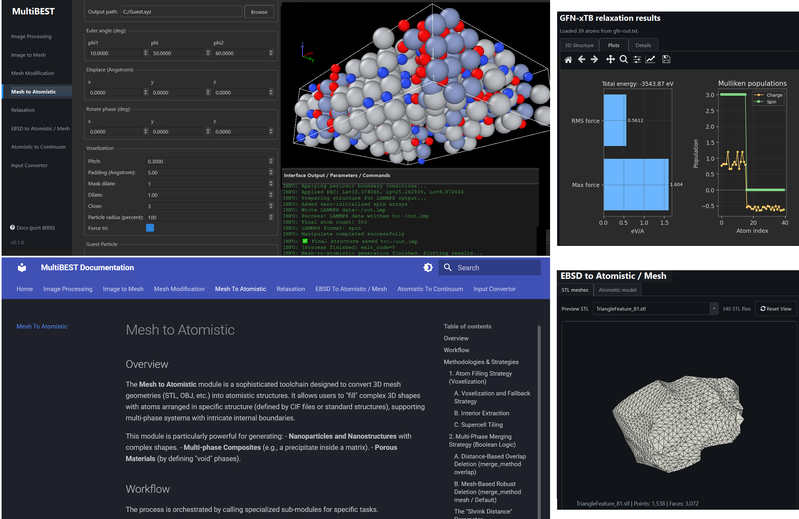

<p align="center">
  
</p>

# MultiBEST – Multiscale/Multiphase Bridging Experiment and Simulation Toolkit

[](https://www.gnu.org/licenses/gpl-3.0)

MultiBEST is a GUI-based, end-to-end framework for constructing
experiment-identical microstructures for atomistic, continuum, and multiscale
simulations. Instead of relying on idealized or implicit microstructures,
MultiBEST starts directly from experimental or user-defined inputs and preserves
microstructural detail across all modelling stages:

- 2D micrographs (optical/SEM)
- 2D / 3D EBSD datasets
- Simple user sketches of microstructures

From these inputs, MultiBEST builds:

- Atomistic models with grain-resolved crystallography and phase identity
- Continuum meshes in which grain boundaries are explicit volumetric interphases
  with their own material properties (diffusivity, elasticity, transport tensors,
  etc.), not just invisible voxel transitions or weightless surfaces

Moreover, users can provide the morphology of a microstructure or object as a
mesh and construct an atomistic model with desired atomic compositions and
crystallographic orientations.

<p align="center">
  
</p>

## Modules

Each module runs independently from the command line or through the central GUI.
Per-module guides live under [docs/modules](docs/modules/index.md).

| Module | Purpose |
|--------|---------|
| **Image Processing** | Edit, threshold, and annotate experimental images; analyse binary section areas; generate area-preserving random binary replicas. |
| **Image to Mesh** | Convert binary microstructure images into 3D phase-region meshes. |
| **Mesh Modification** | Refine, smooth, clean, repair, and transform mesh files. |
| **Mesh to Atomistic** | Fill mesh volumes with atomistic structures, merge phases, export simulation-ready files. |
| **Relaxation** | Relax atomistic structures with GFN2-xTB or SevenNet workflows. |
| **EBSD to Atomistic / Mesh** | Process EBSD data into grain-resolved meshes and fill grains with oriented atoms. |
| **Atomistic to Continuum** | Identify grains/phases in atomistic microstructures and build continuum meshes. |
| **Input Convertor** | Convert atomistic structures between formats; generate LAMMPS data/dump files. |

## Getting Started

Download the archive for your platform — Windows or Ubuntu/Linux — from the
[Releases](../../releases) page, extract it, and launch the `MultiBEST`
executable directly. No build step and no Python environment required.

### GUI and Command-Line Use

MultiBEST supports both graphical user interface (GUI) and command-line interface (CLI) workflows.

For most users, we recommend using the provided binaries through the GUI. After selecting the desired module, setting the parameters, and clicking Run, MultiBEST automatically saves the corresponding input file in `.txt` format in the selected working directory.

Each module can also be executed independently from the command line using its saved input file. For example, in the Linux version:

```bash
EBSD_Atomistic input.txt
```

Users may also create or edit input files manually when required. The CLI workflow is particularly useful for high-throughput calculations, constructing automated workflows, and running MultiBEST modules on computing clusters.

## Documentation

Open the in-app help (the **?** button in any module) for the bundled module
guides, or browse [docs/modules](docs/modules/index.md).

## Example data

The [`examples/`](examples/) directory contains sample inputs for the modules.
See [`examples/DATA_SOURCES.md`](examples/DATA_SOURCES.md) for provenance and
licensing.

## Contributors

MultiBEST is built by the people listed in [`CONTRIBUTORS.md`](CONTRIBUTORS.md).

## License

MultiBEST is free software, licensed under the **GNU General Public License
v3.0 or later (GPL-3.0-or-later)** — see [`LICENSE`](LICENSE). Bundled
third-party components retain their own licenses; see
[`THIRD_PARTY_NOTICES.md`](THIRD_PARTY_NOTICES.md).

Copyright © 2026 bright-ideas-clan
